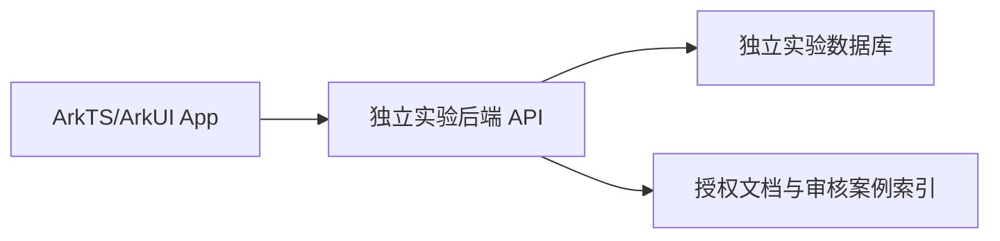

# 初期架构决策

## ADR-001：独立原生 App 与实验环境

单一 Stage `entry` HAP，以 ArkUI `Navigation` 提供页面跳转；`features/service`、`repair`、`knowledge` 划分领域，`core/auth`、`network`、`ui` 承载共享能力。初期仅建立可编译导航骨架，不制造业务数据。

本仓库暂不包含后端实现。后续实验服务可以从经审查的原 Web 代码派生到**独立仓库/环境**，不得直接在生产仓库或库上开发、迁移和测试。共享 API 必须记录请求/响应、角色、错误、状态转移和调用页面。

## ADR-002：原生鉴权待契约确定

已核查 Web 服务使用 Cookie Session 和 Origin 白名单。原生端优先采用服务端验证的 Bearer 会话；令牌安全存储、过期、登出和角色变化要在实验环境验收。不得发送伪造的生产 Origin。当前 `core/auth` 与 `core/network` 仅有类型边界，不执行登录或请求。

## ADR-003：两套业务状态

计划中的客户报修单负责申请、受理和处理进度；既有 `RepairRecord` 负责成员维修备案和审核。两者关联的基数、取消规则及具体状态名要在模型 Issue 定稿。当前活动报名的关联机制可作参考，不能直接重用为一般报修单。

## ADR-004：知识发布门槛

手册章节保留版本与引用定位；维修案例先做授权/脱敏/事实证据审核，再进入可见级别对应的索引。问答依证据返回或追问/拒答，建单只生成可编辑草稿，人工提交。
