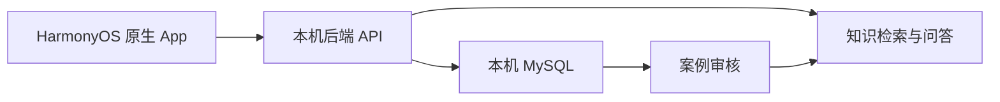

# 开发方案

根据项目组提供的《鸿蒙电脑医院课设_开发方案与Issue拆分基线.md》（2026-09-28）保留功能主线，并按用户当前决定简化：开发进度由团队自行安排，现有 Issues 全部取消，不采用固定周计划、任务编号、强制 PR 或成员审批。本地数据库直接运行，不使用 Docker。

## 目标与范围

做一款 HarmonyOS 原生手机应用，以电脑医院维修服务为场景，界面主要参考“我的华为”的服务板块。课程演示应能完成客户与工作人员之间的真实业务链，并展示有出处的 AI 问答和维修案例回流。

| 模块 | 要实现的能力 |
| --- | --- |
| 登录与个人页 | 登录、恢复会话、退出、显示角色、处理会话过期 |
| 客户服务 | 服务首页、设备和故障描述、报修提交、我的报修列表与详情、进度时间线 |
| 工作人员 | 待处理列表、详情、受理与状态更新、维修备案草稿和提交 |
| 知识问答 | 查询资料、AI 回答或追问、证据不足提示、可打开的来源引用 |
| 辅助建单 | AI 生成可编辑报修草稿，由客户检查后手动提交 |
| 案例回流 | 从维修记录提取故障卡、审核/退回、发布后加入检索 |

活动报名、语音、卡片、平板适配等由团队根据时间选做。页面处理加载、空数据和失败状态；占位页不计作已完成功能。

## 业务链

1. 客户描述设备故障，可先咨询 AI。
2. 客户检查并提交报修；工作人员看到新单。
3. 工作人员受理、更新状态，客户刷新后看到真实变化。
4. 工作人员完成维修，填写备案并提交审核。
5. 有权限的工作人员审核记录和提取的故障卡。
6. 发布案例后，用另一种问法检索并打开原始依据。

客户只访问本人单据及公开知识；工作人员按服务端权限访问业务和内部资料。报修处理状态和维修备案审核状态分别维护。

## 已核实的业务基础

原 Web 核查起点是提交 `64eb141ec21468c46f001dbe7cdab1183e4cb23c`；课设后端由这份已提交源码开始。

- 技术栈为 Next.js App Router、TypeScript、Prisma、MySQL 协议数据库；原服务使用 GreatSQL，本课设改用本机 MySQL。
- 原会话通过 HttpOnly Cookie 读取 Session，写请求检查 Origin；原生 Bearer 通道需要实际实现，不能假定现成可用。
- API 使用成功/失败信封：`success`、`data` 或 `error`、`meta`，列表可能含分页信息。
- `RepairRecord` 属于工作人员成员档案，包含日期、分类、机型、内容、结果、照片、审核及时间线。审核状态为 `DRAFT → PENDING → APPROVED / REJECTED`，退回可重提。
- 原代码没有通用客户报修单。维修活动报名在接待时可生成 `RepairRecord`，这是活动流程。
- seed 提供角色、分类和技能字典；持久测试账号和维修业务数据需要单独准备。

实现一般报修时，新增客户报修对象，并明确它和维修备案的可选关联。`RepairRecord` 审核状态不代表客户维修进度。

## App 与本地后端

- `core/auth` 管会话，`core/network` 管请求和错误，`core/ui` 管导航与主题；业务模块位于 `features/`。
- 后端使用本地课设开发库和独立测试库；迁移、seed 和数据库测试以其实际可用脚本为准。
- 页面只接真实存在的接口，新增模型与接口先确定字段、角色、状态及错误行为。
- 原生登录需要服务端验证的会话契约；不通过伪造 Origin 绕过原 Web 保护。
- 手机调试使用电脑局域网地址；电脑后端健康检查、App 构建和真机联调分别验证。

## AI 与知识资料

先用项目可用的手册或指南建立基础检索，保留章节、版本和引用位置；再加入审核后的维修案例。原记录未写出的根因、机型或结果保持未知。

问答流程：问题及角色 → 检索 → 权限过滤 → 回答/追问 → 检查引用 → 展示来源。无命中时说明证据不足，可引导报修；不能为演示问题硬编码回答。AI 建单只生成草稿，提交和维修状态变更由人确认。

案例故障卡保留来源记录、证据、审核状态和可见范围；通过审核后进入相应索引，退回或撤回的案例不对客户发布。索引构建在后端执行，支持新增和更新后重新检索。

评测由团队自行选择代表性的问题，覆盖有依据回答、换一种问法、信息不足、无命中、权限错误和草稿字段。报告真实结果及典型失败，不预设完成日期。

## 参考界面与演示

[五张“我的华为”截图](reference/my-huawei/README.md)用于视觉参考。主要借鉴服务页的设备卡片、维修与进度入口，以及个人页的服务记录入口；截图没有覆盖入口后的全部流程。

最终演示包括：客户登录与咨询、引用打开、人工确认报修、工作人员处理、客户查看变化、维修备案审核、案例入库后再次检索。再展示一个无依据或无权访问的失败场景。界面截图、设备信息、应用包和四人贡献按实际完成情况记录。

## 当前状态

App 已有可编译的 Stage 工程、导航、主题和三个模块入口，业务尚未接入。后端正在切换为本机直接运行。SDK 和设备以团队能实际使用的版本为准；真机登录、跨角色业务与 AI 回流尚未验证。每次实现后同步更新真实进度即可。
