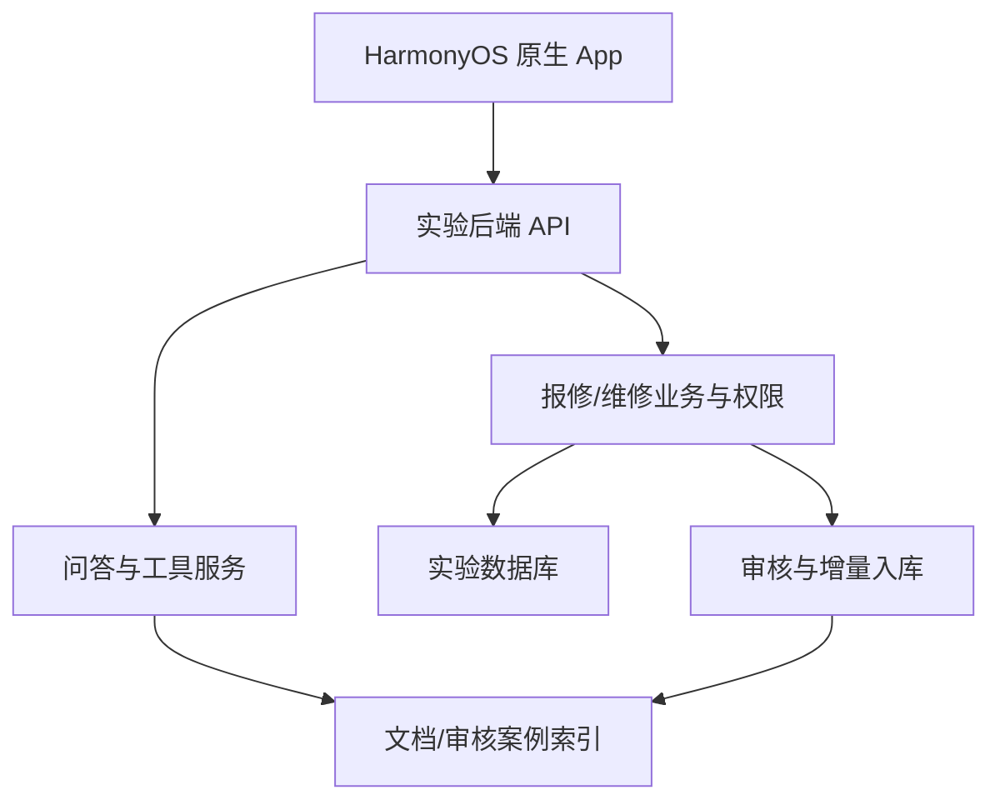

# 鸿蒙电脑医院课设：开发方案与 Issue 拆分基线

> 版本：v1.0｜日期：2026-09-28｜状态：待团队核对的执行基线
> 用途：统一课设范围、接口契约、验收口径和协作方式；后续可依此拆成 GitHub Issue。
> 本文依据《鸿蒙课设方案讨论纪要》及后续讨论编写。凡标注 **待核实** 的事项，在实际仓库、数据库或设备上确认前不得当成现有能力。

## 1. 项目定位与完成标准

课程交付是一款 **HarmonyOS 原生手机应用**，以电脑医院社团的电脑维修服务为场景，使用独立实验环境运行。重点展示界面效果、与参照 App 的相似程度、真实可运行的功能和团队工作量。无需以正式上架、长期商用作为完成前提。

- **主要参照对象**：“我的华为”App 的「服务」板块，参考服务入口、故障描述、服务记录、进度详情等移动端信息组织和交互。正式设计前由团队实际安装、截图并记录版本；本文不声称其当前页面细节已经核验。
- **辅助参照**：联想类电脑服务应用的设备与故障场景；iFixit 的维修知识内容。不能把三个产品的功能拼接后宣称完整复刻某一个 App。
- **本项目扩展**：校园预约、工作人员工作台、基于资料的 AI 问答与辅助建单、维修记录审核后形成知识案例。
- **真实性要求**：演示数据可以预置并标注为测试数据，必须走正式接口、权限和状态流转；不得按演示问题硬编码回答，或用固定录屏替代实际运行。备用录屏仅用于现场网络/设备故障时说明情况。
- **完成标准**：一台或两台手机上可分别登录客户与工作人员测试账号，完成一条跨角色业务链；AI 回答可打开所依据的资料；审核后的案例可被后续查询命中；错误、无依据和越权场景有明确结果。

### 1.1 交付物

1. HarmonyOS 工程与可安装、可运行的应用包；ArkUI 原生页面，不用 WebView 整站套壳。
2. 实验后端与必要迁移、配置样例、初始化脚本；与生产数据及密钥隔离。
3. 脱敏文档/案例语料、可重复执行的索引构建流程、评测集与结果。
4. 真机演示脚本、主要页面截图/录屏、课设报告和四人贡献记录。
5. 参照 App 页面到本项目页面的对照图；标注相似设计和新增能力。

## 2. 已知基础与待核实前提

讨论纪要记录：原平台为 Next.js App Router + Prisma + GreatSQL，提供 `/api/v1/*`、维修记录、审核、评论、活动等模型与接口；鉴权从 Cookie 读取 session，写请求检查 Origin；seed 不包含维修记录。上述属于 **纪要所述的仓库核查结果**，开工时仍应以实验 fork 的实际 commit 和接口测试为准。

| 编号 | 需要确认的事 | 影响 | 最晚确认 |
|---|---|---|---|
| P0-1 | 老师认可的目标 HarmonyOS 版本、DevEco/SDK、团队可用真机及调试权限 | 原生能力及演示可行性 | W1 |
| P0-2 | 客户提交的报修/预约对象、维修备案 `RepairRecord`、活动与签到如何关联；现有状态机是什么 | 是否需新增业务模型与 API | W1 |
| P0-3 | 测试库里经审核、允许使用的记录数量与质量；社团文档使用授权 | 案例库覆盖范围 | W1 |
| P0-4 | 实验环境、域名/HTTPS、图片存储、可用设备的网络连通性 | 真机联调 | W1 |
| P0-5 | 两类账号的现有角色权限、记录可见范围、评论/照片的隐私字段 | 授权与知识发布 | W2 |
| P1-1 | “我的华为”实际安装版本、选定页面截图和功能路径 | 仿照相似度可核验 | W2 |

**决策门槛**：P0-2 若确认现有系统只有“维修后备案”，则先定义客户预约/报修单，并建立它与维修备案的一对零或一关系；不要把维修记录直接当成客户报修单。状态名称以核查后的业务为准，不强加“快递寄修/取机”等不适用流程。

## 3. 角色、权限与业务流程

### 3.1 角色

| 角色 | 能做的事 | 数据边界 |
|---|---|---|
| 客户 | 查看公开资料、AI 咨询、创建报修/预约、上传故障照片、看自己的状态与结果、按需报名活动 | 只能看本人单据及公开知识 |
| 工作人员 | 查看获分配或业务授权范围的待处理单、处理状态、记录维修经过、查询内部案例 | 不能通过改请求参数访问无权数据 |
| 审核员/管理员 | 审核维修记录和知识卡、发布/退回案例 | 以现有角色设计和后端授权为准；可由具备权限的工作人员兼任 |

单个原生 App 登录后进入对应工作台；若测试账号具有多角色，明确默认入口和切换规则。权限必须由服务端判定，前端只负责展示入口与错误提示。

### 3.2 主业务链

1. 客户选择设备/故障分类，描述症状，可上传照片；可先向 AI 咨询。
2. AI 根据证据答复，或追问；客户选择「生成报修草稿」后检查和修改字段，再人工提交。
3. 工作人员看到新单，按社团实际流程受理或确认预约，更新处理状态；客户可查看时间线。
4. 工作人员完成维修，填写现象、排查、结果和必要照片，按原审核规则提交。
5. 审核员审核业务记录；独立检查 AI 提取的故障卡，确认可公开范围后入库。
6. 再用同类问题检索，答案显示文档章节或可公开案例的引用；点击引用可看到相应资料。

**状态边界**：客户报修单的流转与维修记录的草稿/提交/审核是两套状态。状态更新记录操作者、时间和必要说明；不能仅修改客户端本地显示。

### 3.3 其他业务

活动报名、签到、通知、评价、排行等按原接口盘点结果与时间决定。它们可以丰富 App，但不得挤占主业务链的联调与验收时间。

## 4. 功能范围与页面

### 4.1 客户端

| 页面/能力 | 必做行为 | 验收证据 |
|---|---|---|
| 登录与个人页 | 登录、恢复会话、退出、显示角色；过期后回登录页 | 真机跨重启、过期演示 |
| 服务首页 | 报修、AI 咨询、我的报修、知识库入口；加载/空态/失败态 | 对照参照 App 截图 |
| 报修表单 | 设备/机型、分类、描述、照片、联系方式等字段按实际契约；草稿检查 | 提交后列表与详情可见 |
| 我的报修与详情 | 自己的记录、进度、处理时间线及结果；分页/刷新 | 工作人员更新后可看到新状态 |
| AI 咨询 | 问题输入、必要追问、来源引用、证据不足提示、生成草稿 | 多种问法/无命中测试 |
| 知识详情 | 展示授权可见的公开文档或已发布案例 | 引用能定位相应内容 |

### 4.2 工作人员端

| 页面/能力 | 必做行为 | 验收证据 |
|---|---|---|
| 工作台 | 待处理、处理中、待补全等摘要及入口 | 与后端实际数一致 |
| 报修处理 | 详情、状态更新、操作说明和时间线 | 客户端同步看到变更 |
| 维修备案 | 创建/编辑草稿、提交审核，相关必填项符合现有规则 | 草稿与提交后的数据真实持久化 |
| 内部知识查询 | 搜故障与案例，显示内部允许的技术细节 | 与客户可见内容有权限区分 |
| 审核入口 | 有权限者审核记录/知识卡、退回并写原因 | 退回不会进入公开索引 |

### 4.3 选做功能及进入条件

| 功能 | 进入条件 |
|---|---|
| 活动报名与签到 | 主链 W6 前稳定；既有接口可复用 |
| 语音输入 | 真机 SDK 与权限验证通过；转写结果仍需人工确认 |
| 万能卡片 | 主链稳定；能显示真实的本人待办/预约数据 |
| 平板适配 | 已有手机布局、设备和演示时间 |
| 小艺意图入口 | 账号、SDK 与现场调用已验证；作为入口，不改变业务能力 |
| 推送、扫码、离线同步、跨设备流转 | 单独估时、单独验收，不写入必做承诺 |

## 5. AI 与知识库设计

### 5.1 语料与发布

- **规范层**：现有社团手册，按章节或语义段落保留标题、路径、版本和引用定位。
- **案例层**：仅使用已获审核且允许用于实验的维修记录，提取现象、已排除项、根因、处置、机型、耗时、分类等。原记录没写明的字段保持未知，不由模型补事实。
- **故障卡**：保存来源记录 ID、原文证据片段/位置、审核状态、可见级别、更新时间、抽取模型/提示词版本。审核通过才进入面向客户的索引；内部视角也受原始记录权限约束。
- **脱敏**：对姓名、电话、QQ、学号、地址及照片/评论里的识别信息做审核。已有遮罩函数可复用，但字段遮罩不等于整条记录已安全公开。
- **冷启动**：先用真实手册覆盖 3–5 个高频主题；盘点历史案例后再定案例目标。社员补写真实、经审核的指南；测试问题可合成改写，但不得把虚构维修经历写成真实案例。

### 5.2 在线问答

流程：用户问题和角色 → 检索规范与案例 → 授权过滤 → 生成回答 → 校验引用与证据 → 返回答案或继续追问/引导报修。

- 先做可复现的基础检索与有来源回答。分类/机型可用于排序；只有权限及确切的限定条件才硬过滤。
- 客户答案只提供安全的排查建议、服务流程和证据支持的结论；无法确定根因、耗时、收费时要说明尚待检查。
- 工作人员答案可给排查顺序、相似案例及证据，但保留“可能原因”与“已证实根因”的区别。
- 无匹配资料时说明知识范围、提出必要澄清问题或提供报修入口；引用既可指向文档章节，也可指向经授权的案例，不要求每条答案都有 `recordId`。
- 工具调用首批只做「查询本人报修状态」与「生成尚未提交的报修草稿」。工具参数由后端校验身份、归属与字段；模型不能直接提交或改变维修状态。

### 5.3 离线处理与成本

实验服务器负责抽取、审核与索引；端侧不运行索引构建。批处理支持按来源 ID 和内容哈希增量处理、断点续跑、暂停、失败重试上限、人工复核、输入/输出 token 与费用记录。模型/API 选型以小样本质量、预算和服务器资源实测决定；不要在做完评测前固定“必须混合检索 + rerank + 自托管”。

### 5.4 评测

W3 前冻结首批 30–50 个与业务相关的问题，包含规范查询、相似案例、信息不足、无命中、错误机型、越权与建单字段抽取。测试集记录原始问题、期望证据、期望行为、人工判定准则；与调参样本区分。

至少报告：来源检索命中率、引用是否支持结论、答案是否正确落实用户意图、应拒答/追问时的行为、草稿字段正确率、端到端完成率、典型失败例。可比较「仅文档」与「文档+案例」的实际差异；样本小则明确结论范围。

## 6. 技术架构与接口契约



- **环境**：独立实验仓库/服务/数据库/存储与测试账号。先确定从原仓库 fork、复制或新建的具体方式、授权及同步策略；生产迁移和密钥不得直接沿用。
- **鉴权**：优先为原生客户端设计服务端可验证的 Bearer 会话通道；Cookie Web 请求继续执行原有 CSRF/Origin 保护。不要通过客户端伪造生产 Origin 或全局放行 Origin 解决鉴权。令牌安全存储、过期、退出及角色变化须验证。
- **网络层**：统一封装 base URL、鉴权头、统一信封 `{success,data,meta}`、错误码、分页、上传和超时。任何写入先设计幂等或防重复提交策略。
- **模块**：`core/auth`、`core/network`、`core/ui`、`features/service`、`features/repair`、`features/knowledge`、`features/activities`（选做）。在同一 App 中按角色导航；公共业务类型和 API 契约集中维护。
- **接口清单**：只接实际页面用到的端点。每个端点写明请求、响应、角色、错误、状态转移和客户端调用点。新模型/字段先落迁移和合同测试，再做页面。
- **工程验收**：后端按该仓库实际脚本运行 lint/test/build 与必要 DB 集成；鸿蒙工程运行对应构建/静态检查；关键流程须有真机截图或录屏。`pnpm` 脚本不能当作鸿蒙端已验证的证据。

### 6.1 首批接口盘点表模板

| 业务动作 | 已有端点/需新增 | 数据对象 | 可调用角色 | 真机实测 | 负责人 |
|---|---|---|---|---|---|
| 登录、`/me`、退出 | 待核实 | 会话 | 全部 | 否 | 待领 |
| 创建/查询报修 | 待核实 | 报修单 | 客户/工作人员按权限 | 否 | 待领 |
| 处理状态/时间线 | 待核实 | 报修单 | 工作人员/本人只读 | 否 | 待领 |
| 维修备案/提交/审核 | 纪要称有，细节待核实 | `RepairRecord` | 工作人员/审核员 | 否 | 待领 |
| 知识检索/问答 | 新增 | 文档/故障卡 | 按可见级别 | 否 | 待领 |

## 7. 四人轮流开发的协作规则

团队实行 **两个长期锚点 + issue 轮流认领**：A 锚点负责 App 鉴权、网络及接口契约；B 锚点负责知识库与 AI；另外两位在各里程碑参与对应代码评审和接手验证。锚点负责设计一致性和交接，**不包办**该方向全部 Issue。具体人选由团队安排。

- 每个 Issue 以一个可运行、可验收的用户行为或基础契约为边界，常见工作量目标 **1–3 人日**；超过约 4 人日先拆子 Issue。估时是规划参考，不是考核工时。
- 页面与所需 API 能在同一 PR 闭环时合并；数据库迁移、共享网络/鉴权、索引构建等跨页面基础能力单独建 Issue。避免“写所有页面”“实现 RAG”这类大题。
- 每个 Issue 指定唯一 owner、一个 reviewer、前置依赖、验收操作、证据位置；完成后下一人可从说明和截图接手。
- 基础组件先确定 API、导航、主题、列表/表单、加载/失败/空态规则。共享接口变更先更新契约并通知相关 owner。
- 一个功能从 `issue → 分支 → PR → 审查 → 合并 → 真机验收` 留痕；未经过真机只标“代码完成”，不标“功能完成”。
- 使用受保护主分支；不在同一工作区互相切换对方分支。PR 合并后确认远端 commit 和分支 ref；团队之前遇过 Git ref 异常，重要变更另留远端备份。不要因 Git 故障清理不相关业务代码。

### 7.1 Issue 模板

```md
## 目标
用户/工作人员在什么场景完成什么动作。

## 范围
- 包含：
- 不包含：

## 前置与契约
依赖 Issue：#...；接口/模型/权限/设计稿：...

## 验收步骤
1. 使用什么角色、设备、初始数据进入页面。
2. 操作什么；后端状态与另一角色页面应如何变化。
3. 测试空态、错误、过期或越权中的相关场景。

## 完成定义
- [ ] 代码与必要测试通过
- [ ] 构建通过
- [ ] 真机截图/录屏链接与测试设备、系统版本
- [ ] 契约/文档同步更新
- [ ] PR 经另一位成员审核
```

### 7.2 建议的 Issue 拆分地图（标题为示例，实施前按盘点调整）

| 阶段 | 建议 Issue | 依赖 | 可轮流认领 |
|---|---|---|---|
| W1 | 设备与 SDK 真机样例；实验环境和测试数据；业务对象/状态/接口盘点；参照 App 页面截图与映射 | 无 | 四人各一项 |
| W2 | 原生鉴权契约；App 网络层与登录 `/me`；权限和测试账号；主题/导航/表单组件 | W1 盘点 | A 锚点审查 |
| W3 | 报修单模型与状态 API（若缺）；客户报修表单；我的报修列表/详情；工作人员待处理列表 | 鉴权、契约 | 业务功能轮流 |
| W4 | 工作人员处理/时间线；维修备案与报修关联；客户进度刷新；跨角色集成验收 | W3 | 业务功能轮流 |
| W3–5 | 规范文档导入；案例盘点与脱敏；检索 API；引用详情；基础评测集 | W1 语料、鉴权 | B 锚点审查 |
| W5–6 | AI 对话/追问；客户与工作人员不同呈现；生成报修草稿；无命中与错误处理 | 检索、报修 | 前后端配对轮流 |
| W7–8 | 故障卡抽取；审核/退回；增量索引；回流演示与越权验证 | 维修备案、检索 | B 锚点审查 |
| W8–10 | 一个鸿蒙特色功能；视觉对照打磨；评测、报告、真机回归、演示脚本 | 主链稳定 | 四人分担 |

并行原则：独立页面、语料清理与评测标注可并行；共享鉴权/契约/数据库迁移依序落地。任何 issue 数量和工期都以 W1 盘点后校准。

## 8. 里程碑与退出条件

| 时间 | 必须拿到的结果 | 退出条件 |
|---|---|---|
| W1–2 | 真机登录、实验接口、数据模型与参照页面定稿 | 真机登录并读取 `/me`；确定报修与备案关系 |
| W3–4 | 双角色不带 AI 的业务主链 | 客户创建、工作人员处理、客户看到变化；记录能提交审核 |
| W5–6 | 有出处的 AI 咨询与建单 | 问答、追问/无命中、人工确认草稿可在真机连续演示 |
| W7–8 | 维修案例审核回流 | 新纪录抽取、审核、入库、再检索走通；退回不发布 |
| W9–10 | 视觉、鸿蒙能力、评测及答辩 | 演示与备用方案、真机截图、指标表、贡献记录齐全 |
| W11+ | 风险缓冲 | 仅修复阻碍演示或验收的问题 |

每阶段设置“可现场运行”的版本。若时间不足，按 **跨设备流转 → 推送/扫码 → 万能卡片/小艺 → 活动/排行 → 语音/图片 AI** 的顺序缩减；保留双角色业务链、资料引用、人工确认建单、案例审核回流与评测。该顺序可在实际 SDK 可行性和老师反馈后调整。

## 9. 演示与验收脚本

**准备**：记录目标设备与系统版本；准备两个角色和一个审核角色（可与工作人员复用）、脱敏测试数据及文档。测试数据明确标记来源，演示前可重置到已知状态。

1. 展示参照 App 服务入口与本项目首页的对照图，说明借鉴的页面和校园化调整。
2. 客户提问一个文档覆盖的问题；展示回答、文档引用，并打开原文位置。
3. 客户描述另一故障，AI 追问一项缺失信息，再生成可编辑报修草稿；客户确认后提交。
4. 工作人员登录，查看新单、操作状态并填维修记录；客户刷新看到真实进度。
5. 审核员审核记录和抽取的故障卡；用另一种问法查询刚入库的案例，打开脱敏后的引用详情。
6. 演示至少一个失败分支：无证据时不编造结论，或客户尝试访问他人单据被拒绝。
7. 最后展示一个原生鸿蒙能力及评测表；说明四人各自负责的 Issue/PR。

**回归要求**：换一个账号或故障描述，流程仍能运行；清空/新增索引后结果随数据改变；不依赖固定回答、前端假状态或专用演示接口。

## 10. 开工前最终核对清单

- [ ] 四人拿到同一 SDK/API 版本，至少一台真机能安装调试。
- [ ] 确认原平台和课设实验环境的数据/身份/存储隔离方案。
- [ ] 画出报修、预约、维修备案、审核及知识发布的实体关系与状态图。
- [ ] 核对所有实际复用接口、字段及授权；登记需新增 API。
- [ ] 清点真实可用语料和权限，选定首批主题。
- [ ] 采集参照 App 的实际页面，建立页面对照清单。
- [ ] 在 GitHub 建立里程碑、标签、Issue 模板和 PR 模板，再按第 7 节拆分。

---

**范围变更原则**：新想法先写清演示收益、依赖、预计工作量和要替换掉的事项，再由团队决定进入当前里程碑或候选池。文档标注的“必做”是团队建议的课设基线，最终以实际课时、设备和仓库核验结果修订。
